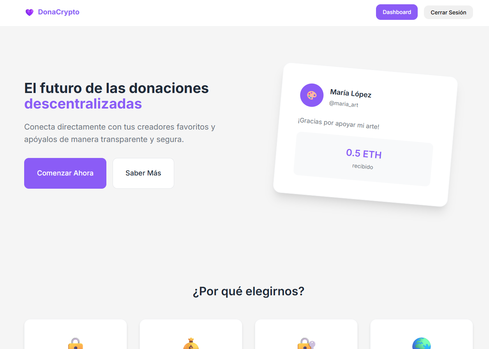
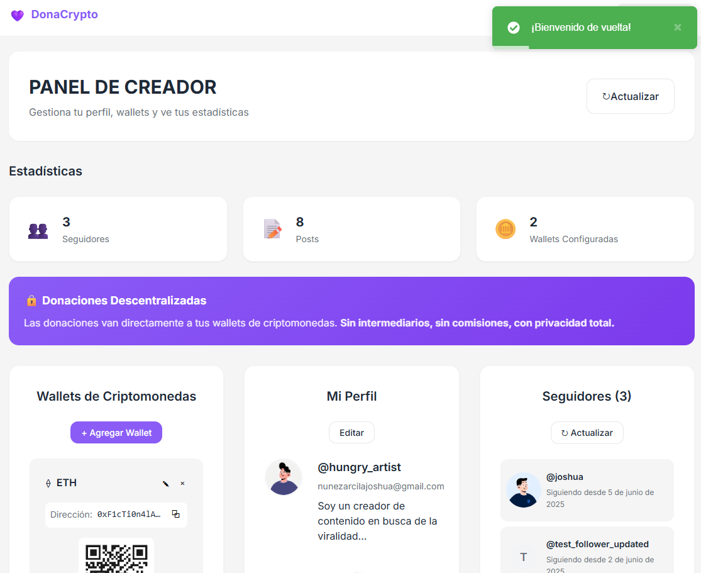
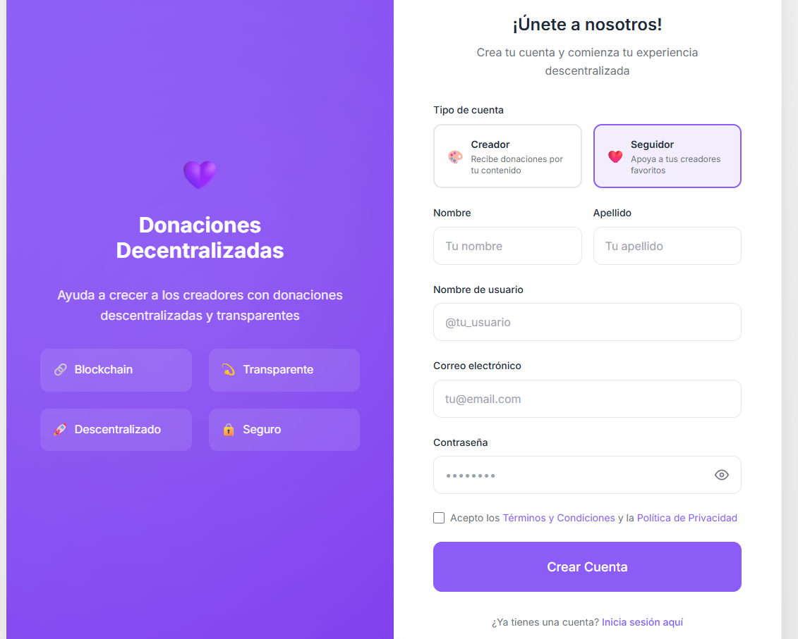
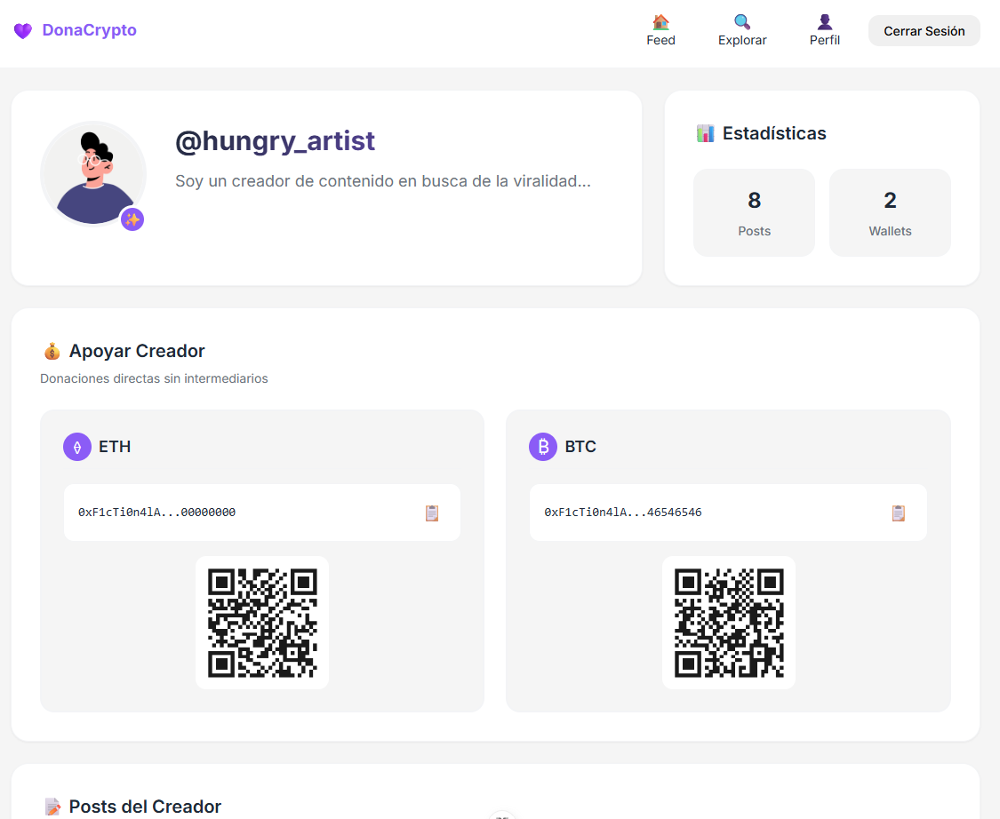
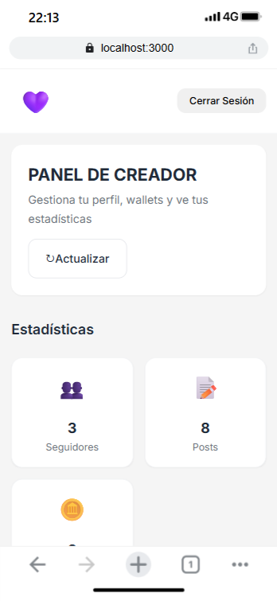
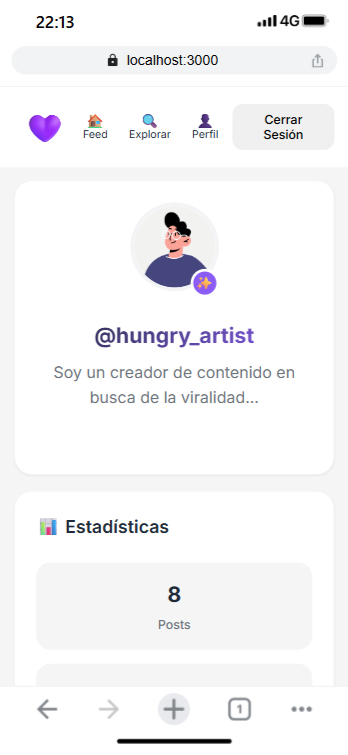
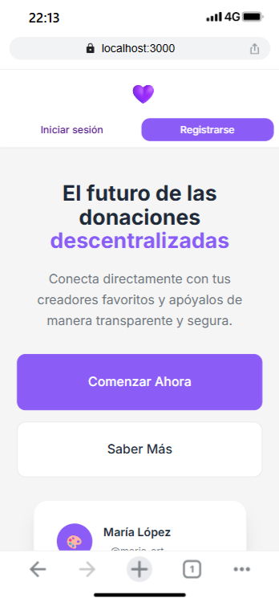

# DonaCrypto

## 🌎 English
A decentralized donation platform for content creators that allows them to receive cryptocurrency donations directly to their wallets, presents full social network features.

## ✨ Features

- 🔐 **Secure Authentication** with JWT and bcrypt
- 👤 **Dual Profiles** for creators and followers
- 📝 **Post System** with personalized feed
- 💰 **Expanded Wallet Management** supporting 24+ cryptocurrencies
- 📱 **Automatic QR Codes** for all wallets
- 👥 **Social Network** - follow/unfollow creators
- 🔍 **Explore and Search** creators
- 📱 **Responsive Interface** optimized for mobile
- 🛡️ **Advanced Security** with account deletion and password change

## 📸 Screenshots

### 🖥️ Web Version

<div align="center">

#### Home Page


#### Creator Dashboard


#### User Registration


#### Creator Public Profile


</div>

### 📱 Mobile Version

<div align="center">

| Creator Dashboard | Public Profile | User Feed | Follower Home |
|------------------|----------------|-----------|---------------|
|  |  |  |  |

</div>

## 🛠️ Tech Stack

### Backend
- **Framework:** Flask + Flask-RESTful
- **Database:** MongoDB with PyMongo
- **Authentication:** JWT (Flask-JWT-Extended)
- **Security:** bcrypt, Flask-CORS
- **Utilities:** python-dotenv

### Frontend
- **Framework:** Vue.js 3 with Composition API
- **State:** Pinia
- **Routing:** Vue Router 4
- **HTTP:** Axios
- **Styles:** SASS
- **Utilities:** date-fns, qrcode, vue-toastification


## 🚀 Installation

### Prerequisites
- Python 3.8+
- Node.js 16+
- MongoDB

### Backend
```bash
cd backend
pip install -r requirements.txt
python app.py
```
The server will be available at `http://localhost:5000`

### Frontend
```bash
cd frontend
npm install
npm run dev
```
The application will be available at `http://localhost:3000`

## 📁 Project Structure

```
donacrypto/
├── backend/                    # Flask API
│   ├── app.py                 # Entry point
│   ├── requirements.txt       # Python dependencies
│   └── app/
│       ├── models/            # Data models
│       ├── routes/            # API endpoints
│       ├── decorators/        # Custom middleware
│       └── utils/             # Utilities
├── frontend/                  # Vue.js Application
│   ├── src/
│   │   ├── components/        # Reusable components
│   │   ├── views/             # Application pages
│   │   ├── stores/            # Global state (Pinia)
│   │   ├── router/            # Route configuration
│   │   └── services/          # API services
│   └── package.json
└── README.md
```

## 🔒 Security Features
- ✅ JWT Authentication with secure tokens
- ✅ Password hashing with bcrypt
- ✅ Role-based route protection
- ✅ Token blacklist for secure logout
- ✅ Input validation on all endpoints
- ✅ Password confirmation for critical operations


## 🎯 Roadmap

- [ ] Metamask integration
- [ ] Real-time notification system
- [ ] Post comments
- [ ] Analytics dashboard for creators
- [ ] Advanced search with filters
- [ ] Dark mode
- [ ] Progressive Web App (PWA)


## 📡 API Endpoints
### Authentication
```http
POST /auth/register    # User registration
POST /auth/login       # Login
POST /auth/logout      # Logout
```

### Users and Profiles
```http
GET  /user/profile              # Get current profile
PUT  /user/update-profile       # Update profile
PUT  /user/change-password      # Change password
DELETE /user/delete-account     # Delete account
```

### Posts
```http
POST /user/posts               # Create post
GET  /user/posts/<username>    # Get user posts
DELETE /user/posts/<post_id>   # Delete post
GET  /user/feed               # Personalized feed
```

### Wallets
```http
POST /user/wallets             # Add wallet
PUT  /user/wallets/<id>        # Edit wallet
DELETE /user/wallets/<id>      # Delete wallet
GET  /user/wallets/<username>  # View public wallets
```

### Social Network
```http
POST /user/follow              # Follow creator
POST /user/unfollow            # Unfollow creator
GET  /user/following           # Following list
GET  /user/search-creators     # Search creators
```

---

## 🌐 Español

Una plataforma descentralizada de donaciones para creadores de contenido que permite recibir donaciones en criptomonedas directamente en sus wallets, con funcionalidades completas de red social.

## ✨ Características

- 🔐 **Autenticación segura** con JWT y bcrypt
- 👤 **Perfiles duales** para creadores y seguidores  
- 📝 **Sistema de publicaciones** con feed personalizado
- 💰 **Gestión de wallets expandida** con soporte para 24+ criptomonedas
- 📱 **Códigos QR automáticos** para todas las wallets
- 👥 **Red social** - seguir/dejar de seguir creadores
- 🔍 **Exploración y búsqueda** de creadores
- 📱 **Interfaz responsiva** optimizada para móviles
- 🛡️ **Seguridad avanzada** con eliminación de cuenta y cambio de contraseña

## 📸 Capturas de Pantalla

### 🖥️ Versión Web

<div align="center">

#### Página Principal


#### Dashboard del Creador


#### Registro de Usuario


#### Perfil Público del Creador


</div>

### 📱 Versión Móvil

<div align="center">

| Dashboard del Creador | Perfil Público | Feed del Usuario | Home del Seguidor |
|----------------------|----------------|------------------|-------------------|
|  |  |  |  |

</div>

## 🛠️ Stack Tecnológico

### Backend
- **Framework:** Flask + Flask-RESTful
- **Base de datos:** MongoDB con PyMongo
- **Autenticación:** JWT (Flask-JWT-Extended)
- **Seguridad:** bcrypt, Flask-CORS
- **Utilidades:** python-dotenv

### Frontend
- **Framework:** Vue.js 3 con Composition API
- **Estado:** Pinia
- **Routing:** Vue Router 4
- **HTTP:** Axios
- **Estilos:** SASS
- **Utilidades:** date-fns, qrcode, vue-toastification

## 🚀 Instalación

### Prerrequisitos
- Python 3.8+
- Node.js 16+
- MongoDB

### Backend
```bash
cd backend
pip install -r requirements.txt
python app.py
```
El servidor estará disponible en `http://localhost:5000`

### Frontend  
```bash
cd frontend
npm install
npm run dev
```
La aplicación estará disponible en `http://localhost:3000`


## 📁 Estructura del Proyecto

```
donacrypto/
├── backend/                    # API Flask
│   ├── app.py                 # Punto de entrada
│   ├── requirements.txt       # Dependencias Python
│   └── app/
│       ├── models/            # Modelos de datos
│       ├── routes/            # Endpoints de la API
│       ├── decorators/        # Middleware personalizado
│       └── utils/             # Utilidades
├── frontend/                  # Aplicación Vue.js
│   ├── src/
│   │   ├── components/        # Componentes reutilizables
│   │   ├── views/             # Páginas de la aplicación
│   │   ├── stores/            # Estado global (Pinia)
│   │   ├── router/            # Configuración de rutas
│   │   └── services/          # Servicios API
│   └── package.json
└── README.md


## 📡 API Endpoints

### Autenticación
```http
POST /auth/register    # Registro de usuario
POST /auth/login       # Inicio de sesión  
POST /auth/logout      # Cierre de sesión
```

### Usuarios y Perfiles
```http
GET  /user/profile              # Obtener perfil actual
PUT  /user/update-profile       # Actualizar perfil
PUT  /user/change-password      # Cambiar contraseña
DELETE /user/delete-account     # Eliminar cuenta
```

### Publicaciones
```http
POST /user/posts               # Crear publicación
GET  /user/posts/<username>    # Obtener posts de usuario
DELETE /user/posts/<post_id>   # Eliminar post
GET  /user/feed               # Feed personalizado
```

### Wallets
```http
POST /user/wallets             # Agregar wallet
PUT  /user/wallets/<id>        # Editar wallet  
DELETE /user/wallets/<id>      # Eliminar wallet
GET  /user/wallets/<username>  # Ver wallets públicas
```

### Red Social
```http
POST /user/follow              # Seguir creador
POST /user/unfollow            # Dejar de seguir
GET  /user/following           # Lista de seguidos
GET  /user/search-creators     # Buscar creadores
```

## 🔒 Características de Seguridad

- ✅ Autenticación JWT con tokens seguros
- ✅ Hash de contraseñas con bcrypt
- ✅ Protección de rutas basada en roles
- ✅ Blacklist de tokens para logout seguro
- ✅ Validación de entradas en todos los endpoints
- ✅ Confirmación de contraseña para operaciones críticas

## 🎯 Posibles implementaciones a futuro

- [ ] Integración con Metamask
- [ ] Sistema de notificaciones en tiempo real
- [ ] Comentarios en publicaciones
- [ ] Panel de analíticas para creadores
- [ ] Búsqueda avanzada con filtros
- [ ] Modo oscuro
- [ ] Progressive Web App (PWA)
